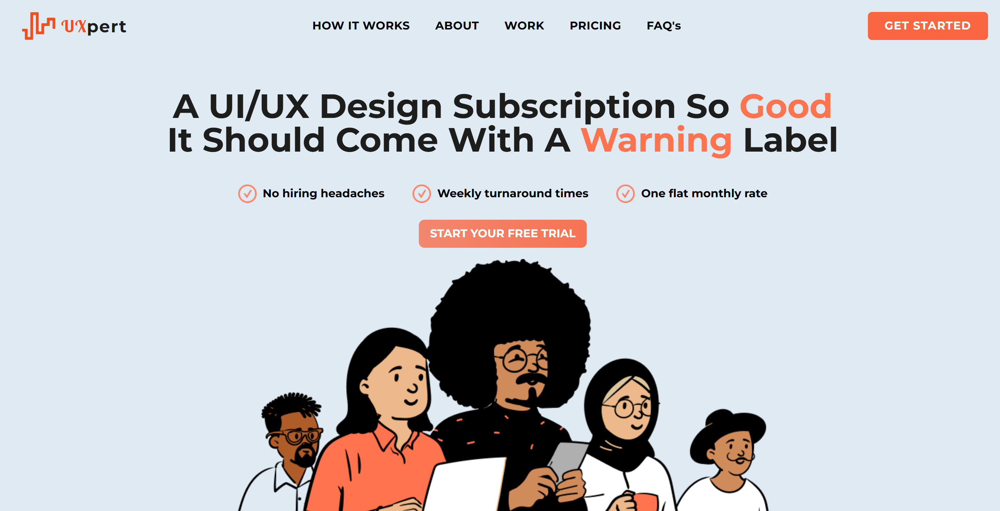

# UI/UX Design Business Landing Page

A modern, responsive landing page for a UI/UX design business built with **React** and **Tailwind CSS**. It highlights services, showcases portfolio items, and includes a contact section for potential clients.



Live demo: (https://uxpert-theta.vercel.app/)

## 🚀 Features

- Responsive and mobile-friendly design
- Clean, minimal UI
- Reusable React components
- Built with Tailwind CSS for easy customization

## 🛠️ Tech Stack

- **React**
- **Tailwind CSS**

## 📦 Installation

```bash
git clone https://github.com/dev-mas-ud/uxpert.git
cd uxpert
npm install
npm run dev
```
